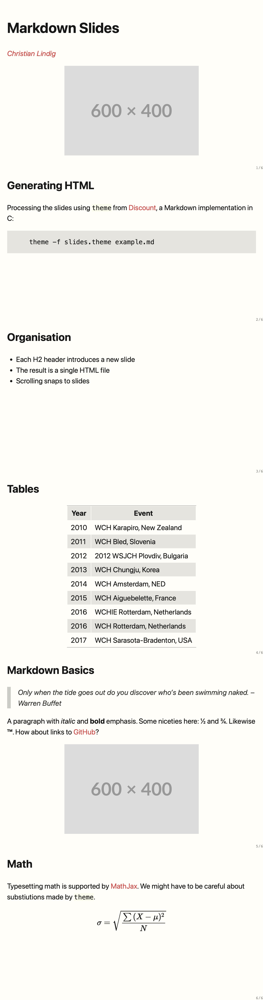

# Markdown Slides

The is a HTML/CSS template to create slides from a [markdown] file using
the `theme` command from David Parsons' [discount] implementation. It
uses CSS from Yihui Xie's [Snap Slides].

I don't claim this is suitable for anybody or anything but I like the
simplicity of the approach.

## Installing Discount

Discount is a small, self-contained implementation of Markdown.

* Ubuntu: `apt-get install discount`
* macOS: `brew install discount`

## Example

Below is the screenshot of [example.md]; all slides are in one page but
in the browser the scrolling snaps to each slide. The corresonding
[example.html] was generated from:

```
theme -c -superscript -t slides.theme example.md

```

On Fedora the command is called `discount-theme`.



## Slide Organisation

Read [Snap Slides] for details and look at [example.md](example.md) for
a starting point.

[example.html]: example.html
[example.md]:   example.md
[markdown]:     http://daringfireball.net/projects/markdown
[discount]:     https://www.pell.portland.or.us/~orc/Code/discount/
[Snap Slides]:  https://yihui.org/en/2023/09/snap-slides/
